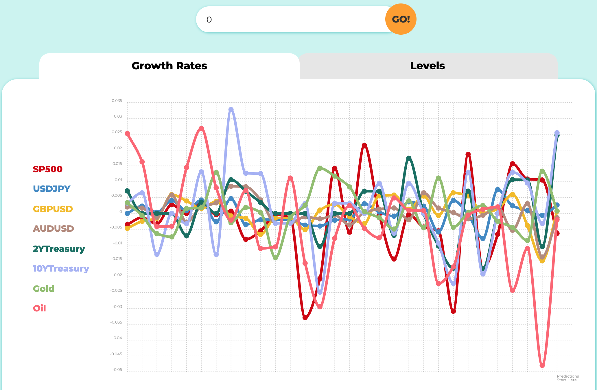
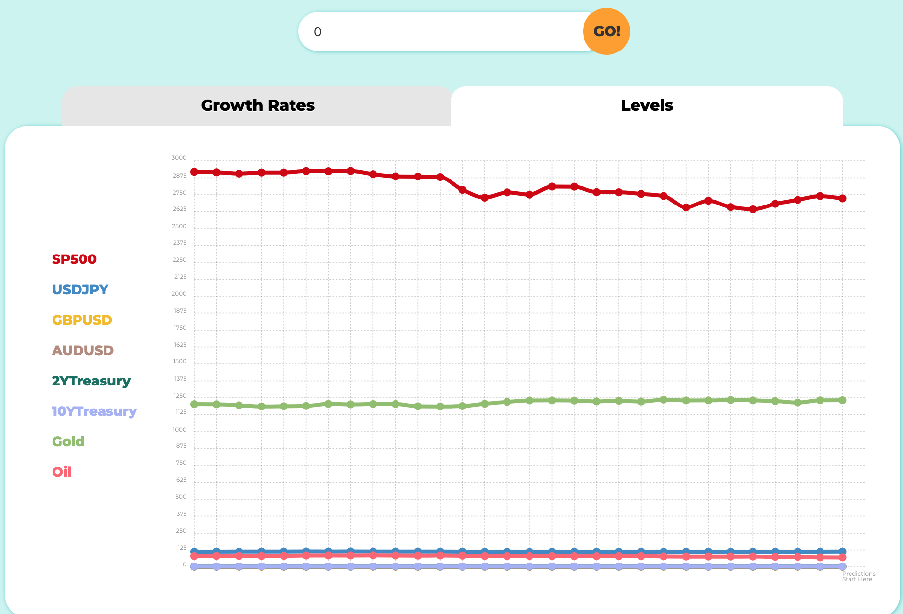
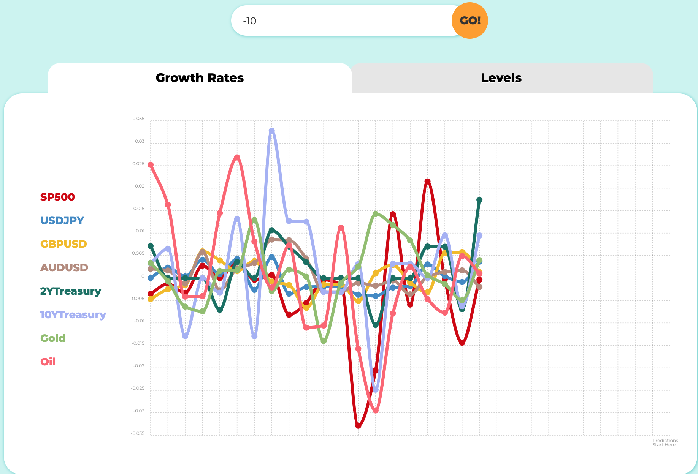
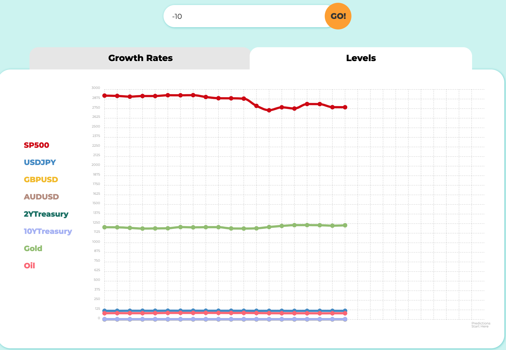
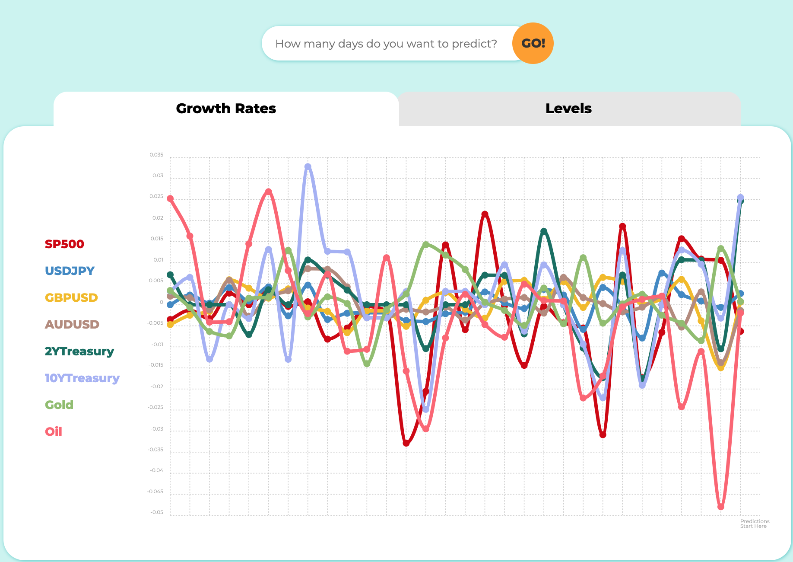

# Market Modeling Testing

## 1. Introduction
This branch's Testing file is where we keep all of our testing files and results.
To specify, there are 2 main parts of testing: 1. Testing for the usability of the webapp 2. Model Performance Testing for Research Paper
We document the webapp usability testing (dynamic testing) here below by trying out different possible user inputs and results.
To see our Model performance testing results, please see the jupyter-nootbooks inside this folder.

## 2. Dynamic Testing: webapp usability test
User input: 10 days

User input: 0 days

User input: -10 days

User input: missing days

